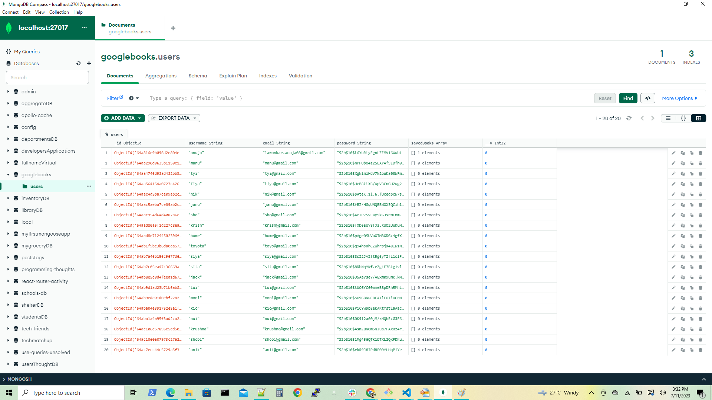
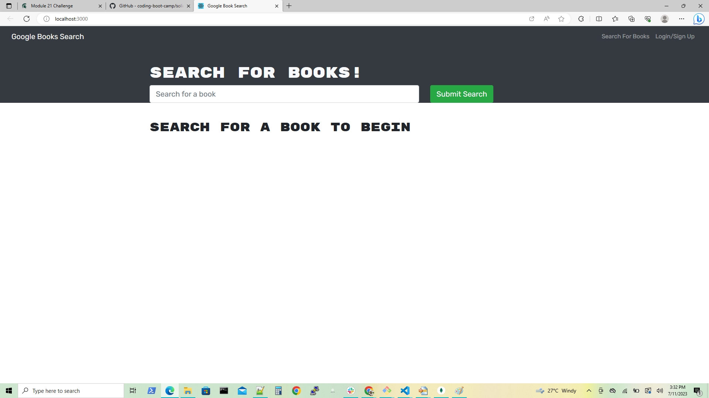
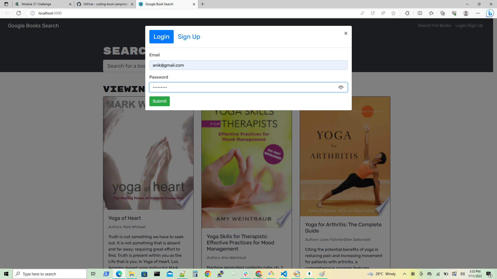
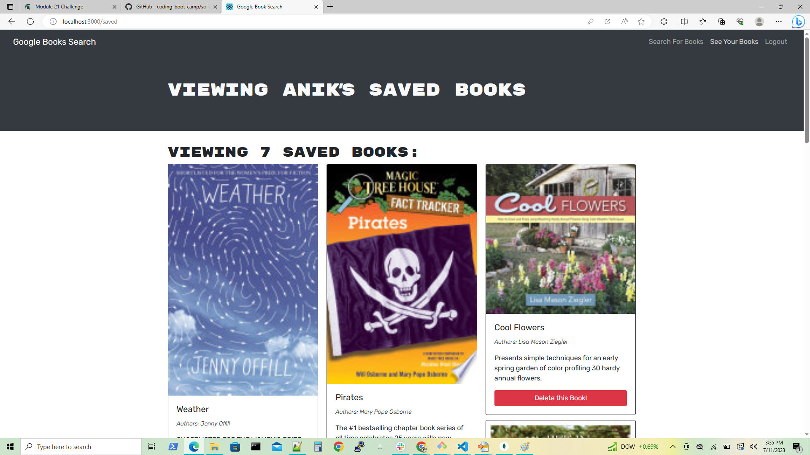
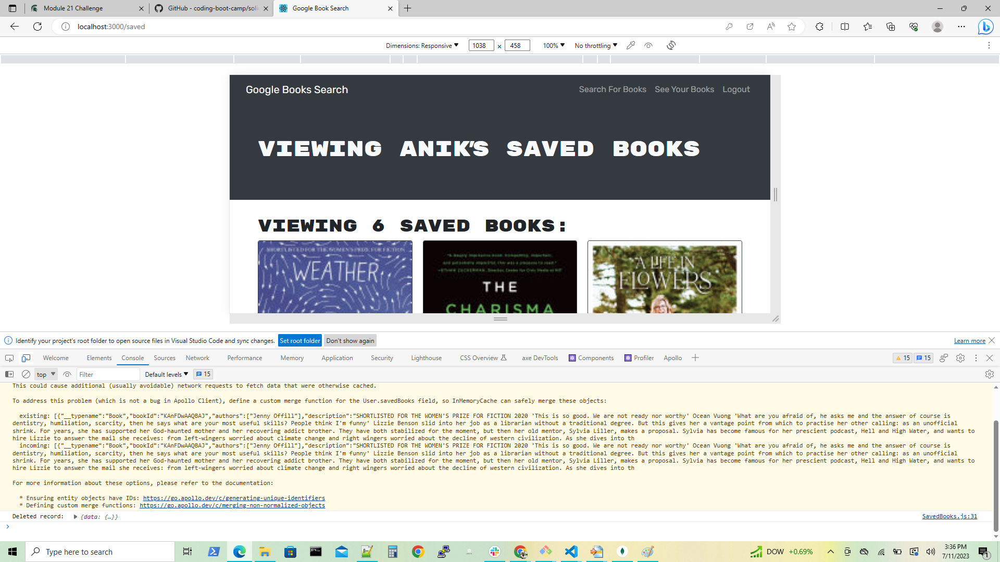

## Book Search Engine-MERN

## Description

1. Book Search Engine-MERN is a web application that can allow user to login and signup and make their own account on this application. Users can saved and delete the books they liked from their account.

2. WHEN user load the search engine.THEN he can  presented with a menu with the options Search for Books and Login/Signup and an input field to search for books and a submit button.

3. WHEN user click on the Search for Books menu option. THEN he can presented with an input field to search for books and a submit button.

4. WHEN user not logged in and enter a search term in the input field and click the submit button. THEN he can  presented with several search results, each featuring a book’s title, author, description, image, and a link to that book on the Google Books site

5. WHEN user click on the Login/Signup menu option. THEN a modal appears on the screen with a toggle between the option to log in or sign up

6. WHEN the toggle is set to Signup. THEN he can presented with three inputs for a username, an email address, and a password, and a signup button

7. WHEN the toggle is set to Login. THEN he can presented with two inputs for an email address and a password and login button

8. WHEN user enter a valid email address and create a password and click on the signup button. THEN user account is created and I am logged in to the site

9. WHEN user enter his account’s email address and password and click on the login button
THEN the modal closes and he logged in to the site

10. WHEN user logged in to the site. THEN the menu options change to Search for Books, an option to see saved books, and Logout

11. WHEN user logged in and enter a search term in the input field and click the submit button. THEN he can presented with several search results, each featuring a book’s title, author, description, image, and a link to that book on the Google Books site and a button to save a book to his account

12. WHEN user click on the Save button on a book. THEN that book’s information is saved to his account

13. WHEN user click on the option to see my saved books. THEN he can presented with all of the books he saved to his account, each featuring the book’s title, author, description, image, and a link to that book on the Google Books site and a button to remove a book from his account

14. WHEN user click on the Remove button on a book. THEN that book is deleted from my saved books list.

15. WHEN user click on the Logout button. THEN he can logged out of the site and presented with a menu with the options Search for Books and Login/Signup and an input field to search for books and a submit button .

## Table of Contents

*  [URLs](#URLs)
*  [Installation](#Installation)
*  [Usage](#Usage)
*  [Techonology](#Techonology)
*  [Assets](#Assets)
*  [Testing](#Testing)
*  [License](#License)

## Steps followed

1. Clone starter code from the remote repository "solid-broccoli" to local repository "Book Search Engine-MERN".

2. Manipulated the code according to the Acceptance Criteria.

3. Created "New Repository" in "GitHub" and named it as, "Book Search Engine-MERN".

4. Created directories and files which are uploaded  from local repository to "GitHub".

5. Navigate to "GitHub" repository "Book Search Engine-MERN" using "Git Bash".

6. Added description, screenshots in  "README"  file.

7. Performed, "add", "commit", "pull", "push", operations on source code.

8.  Deployed and assigned the "URL" to the website.

9. Added screenshot for final website appearance and Git Bash commands.

10. Deployed the entire application to Heroku.

## URLs
Here, you can find the webpage on Heroku.
Application's Heroku URL:- 
https://young-caverns-21915-a988ff223cf9.herokuapp.com/

Here, you can find the GitHub URL:-

https://github.com/AnujaLawankar/21-Book-Search-Engine-MERN

## Installation

This application will use the following npm packages:-

  * npm install express (express.js)
  * npm install --save-dev webpack (Webpack)
  * npm install webpack-dev-server --save-dev (webpack-dev-server)
  * npm install --save-dev webpack-pwa-manifest (WebpackPwaManifest)
  * npm install babel (Babel)
  * npm install --save-dev css-loader (CSS-loader)
  * npm install concurrently --save (run multiple commands concurrently.) (Concurrently)
  * npm npm install idb (IndexedDB)
  * npm install @apollo/client graphql

The required modules are bundled in the package.json file and at CLI or integrated terminal type in npm run install, the modules will be installed.

## Usage

Book Search Engine is a web application for client to search a book they liked. They can signup and login in this web application. They can also saved that book or delete that book from their account to make a purchase list.

## Techonology

1. Monogo DB database.
2. Apolloer server
3. ExpressJS
4. Web Pack
5. ReactJS
6. Document for connection with mongoDB atlas and heroku
https://coding-boot-camp.github.io/full-stack/mongodb/deploy-with-heroku-and-mongodb-atlas

## Assets

The following image demonstrates the web application appearance:
1.  Book Search Engine-MERN database structure.

2. Book Search Engine-MERN web apperance.

3. Signup and login page

4. Search book from user account.

5. Saved books.

6. Delete the unwanted books.

## Testing

1. For testing this web app hit the following command in your terminal

* npm run develop

Both commands can use to start a web application.

## License

 MIT  License  